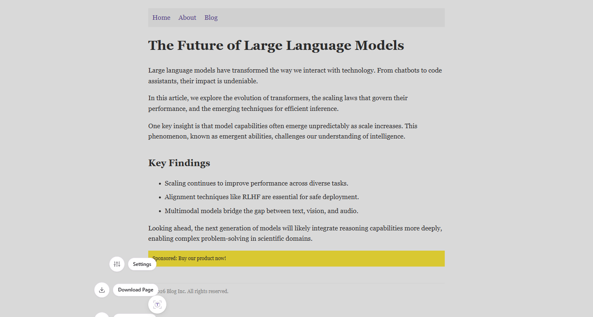
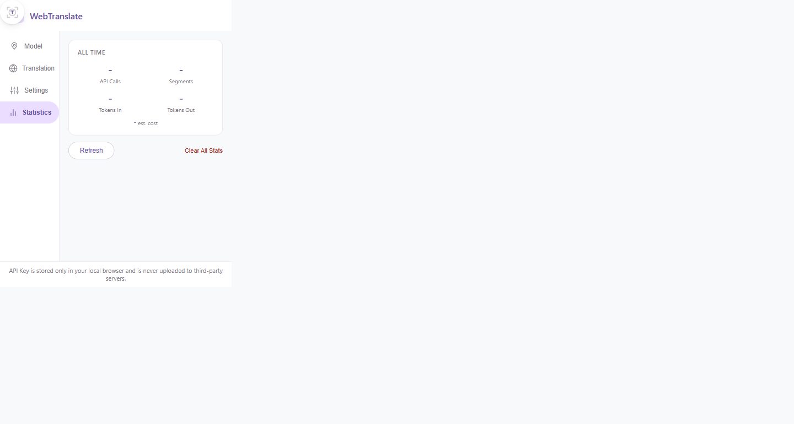
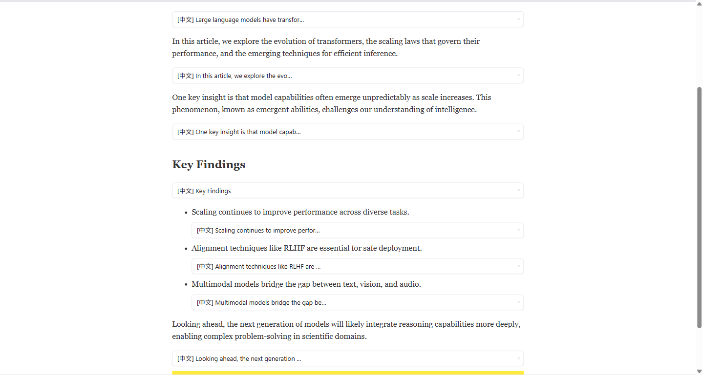

# WebTranslate

[](LICENSE)
[](https://www.google.com/chrome/)

> 基于大模型 API 的网页翻译 Chrome 扩展。点击悬浮按钮即可翻译整篇文章，支持内联和侧边面板两种模式，一键打包下载为 Markdown。

[English](README.md) · [中文](README.zh.md)

---

## 能做什么

打开任意网页，点击右下角悬浮按钮，WebTranslate 会使用你自己的大模型 API Key 翻译文章内容。无需刷新页面，无需复制粘贴。



---

## 使用指南

### 1. 安装扩展

```bash
npm install && npm run build
```

在 `chrome://extensions/` 中加载 `dist/` 文件夹（打开开发者模式 → 加载已解压的扩展程序）。

### 2. 配置 API

点击扩展图标打开设置弹窗，填入 API 地址、Key 和模型名称。



**支持平台：** OpenAI、DeepSeek、Anthropic，以及任何兼容 OpenAI 接口的服务。

### 3. 开始翻译

打开任意文章页面，点击右下角悬浮按钮（FAB），再点击 **Translate**（翻译）。



译文会出现在每段原文下方。页面顶部进度条显示翻译进度。

### 4. 暂停、清除或重翻

点击 **Stop**（停止）暂停翻译。FAB 变为黄色并自动展开，显示所有可选操作：


| 操作 | 说明 |
|------|------|
| **Translate（翻译）** | 继续翻译（已译段落缓存命中，秒开） |
| **Retranslate（重新翻译）** | 清除缓存并重新翻译全部（如更换模型后） |
| **Clear（清除译文）** | 从页面移除所有翻译块，缓存保留（再次翻译瞬间恢复） |

### 5. 下载页面

在 FAB 菜单中点击 **Download Page**（下载页面），将文章保存为 ZIP 文件，包含 Markdown 文本和图片。

---

## 特性

### 双模式翻译
- **内联模式（Inline）** —— 译文插入段落下方，保留缓存
- **面板模式（Panel）** —— 译文显示在 Chrome 侧边栏，不修改原页面

### 智能内容提取
- 提取语义标签（`<p>`、`<h1>`–`<h6>`、`<li>`）和任意有足够直接文本的元素
- 自动排除导航栏、广告、代码块、侧边栏、交互 UI

### 批量翻译
- 每批最多 8 段，合并为一次 API 请求，节省费用

### 缓存机制
- 三级缓存（内存 → session → 本地存储），同一页面再次翻译瞬间完成

### 费用追踪
- 弹窗「统计」标签页显示 Token 用量和预估费用

### 生产级容错
- 指数退避重试、429 限流处理、连续失败断路器

---

## 开发

```bash
npm install
npm run build    # 构建 → dist/
npm test         # 150+ 单元 & 集成测试
npm run lint     # ESLint
```

**技术栈：** Chrome Extension Manifest V3 · 原生 ES2022 · Vite · Vitest · JSZip · DOMPurify · turndown

**文档：**
- [UI 交互设计文档](docs/ui-interaction-design.md)
- [架构图 (English)](docs/architecture-en.md) · [架构图 (中文)](docs/architecture-zh.md)

---

## 许可证

[MIT](LICENSE)
