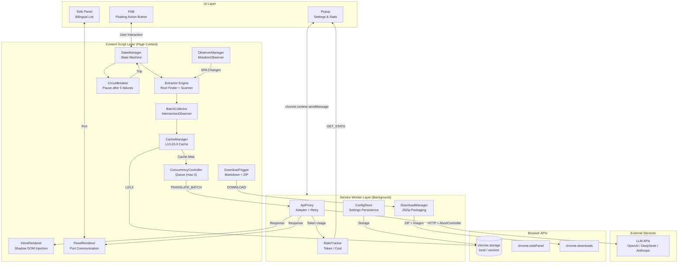
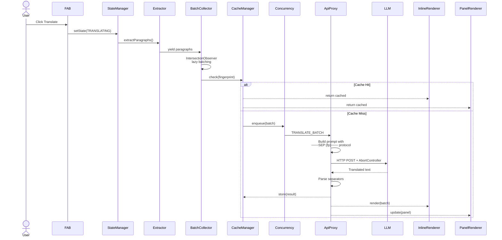
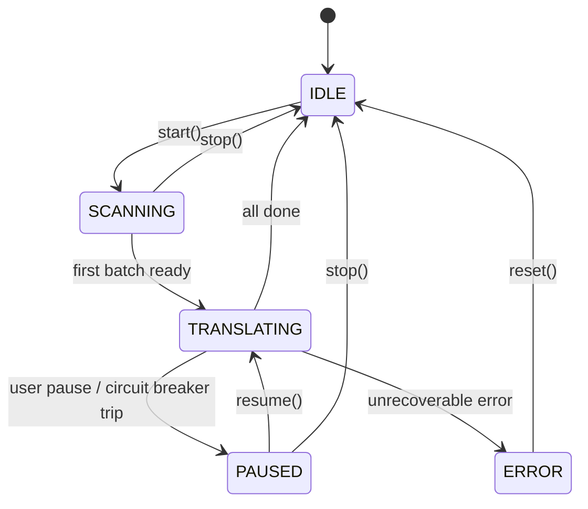
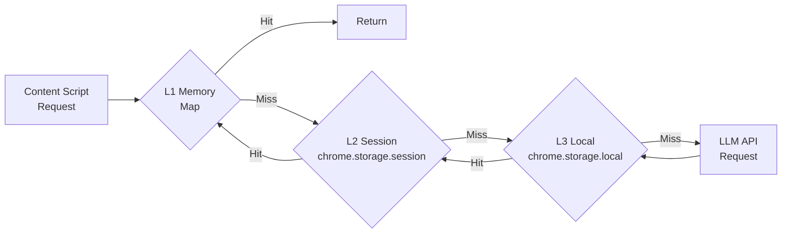
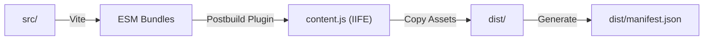
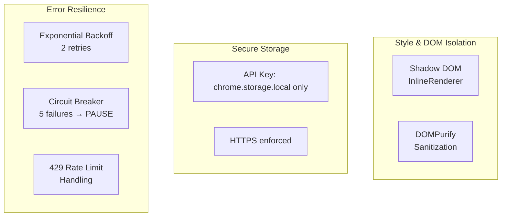

# WebTranslate System Architecture

> English version | [中文版](./architecture-zh.md)

## Overview

WebTranslate is a Chrome Extension (Manifest V3) that provides LLM-powered webpage translation. The architecture follows a three-layer extension model: **UI Layer** → **Content Script Layer** → **Service Worker Layer**, with clear separation of concerns and resilient error handling.

---

## High-Level Architecture

---

## Component Responsibilities

| Component | Layer | Responsibility |
|-----------|-------|----------------|
| **Popup** | UI | 4-tab settings panel (Model / Translation / Settings / Statistics). Config validation, connection testing, export/import. |
| **Side Panel** | UI | Bilingual translation list with copy and scroll-to-paragraph actions. |
| **FAB** | UI | Material 3 floating action button with drag positioning, radial menu, progress ring, and state-based theming. |
| **Extractor** | Content Script | Multi-candidate content root detection + deep DOM scanning. Extracts semantic paragraphs while excluding nav/header/footer/code. |
| **BatchCollector** | Content Script | IntersectionObserver-based lazy collection. Debounced batching: max 8 items, ≤800 chars, 100ms debounce. |
| **StateManager** | Content Script | Guarded state machine: `IDLE → SCANNING → TRANSLATING ↔ PAUSED → ERROR`. |
| **CacheManager** | Content Script | Three-tier cache: L1 (memory Map) → L2 (`chrome.storage.session`) → L3 (`chrome.storage.local`). LRU eviction: 500 entries/page, 10 pages max. |
| **ConcurrencyController** | Content Script | Promise-based queue limiting concurrent API batches to 3. |
| **CircuitBreaker** | Content Script | Trips after 5 consecutive failures, triggers `PAUSED` state to prevent API hammering. |
| **InlineRenderer** | Content Script | Inserts translated text below original paragraphs using Shadow DOM for style isolation. |
| **PanelRenderer** | Content Script | Sends translations to Side Panel via Chrome Port API. |
| **ObserverManager** | Content Script | MutationObserver detects SPA dynamic content changes and triggers re-extraction. |
| **DownloadTrigger** | Content Script | Generates Markdown via turndown.js and triggers background ZIP packaging. |
| **ApiProxy** | Service Worker | Adapter pattern for LLM APIs. Exponential backoff retry (2 retries, 1s→3s), 429 handling, AbortController cancellation. |
| **DownloadManager** | Service Worker | Fetches images, builds ZIP with JSZip, converts to base64 Data URL for `chrome.downloads`. |
| **StatsTracker** | Service Worker | In-memory session stats + persistent all-time/daily stats. Periodic flush to `chrome.storage.local`. |
| **ConfigStore** | Service Worker | Simple `chrome.storage.local` wrapper with in-memory caching. |

---

## Data Flow: Translation Request

---

## State Machine

---

## Cache Hierarchy

---

## Build Pipeline

> Note: Content scripts are bundled as IIFE (not ES modules) because Manifest V3 does not support `type="module"` for content scripts.

---

## Security Model

