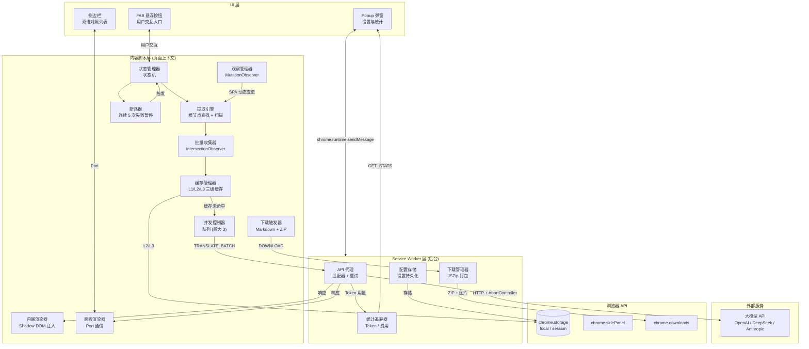
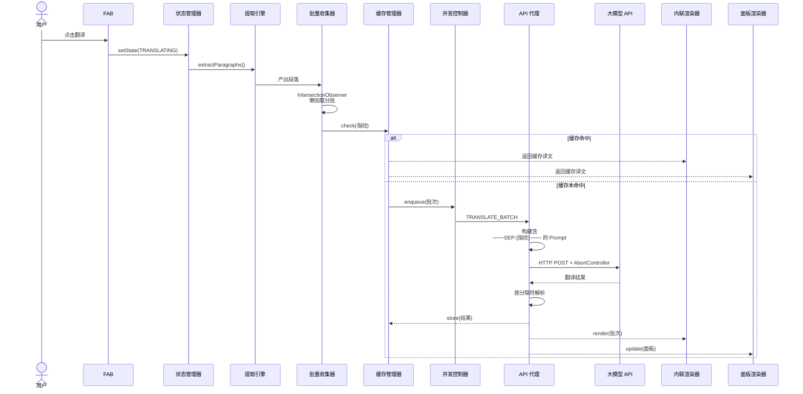
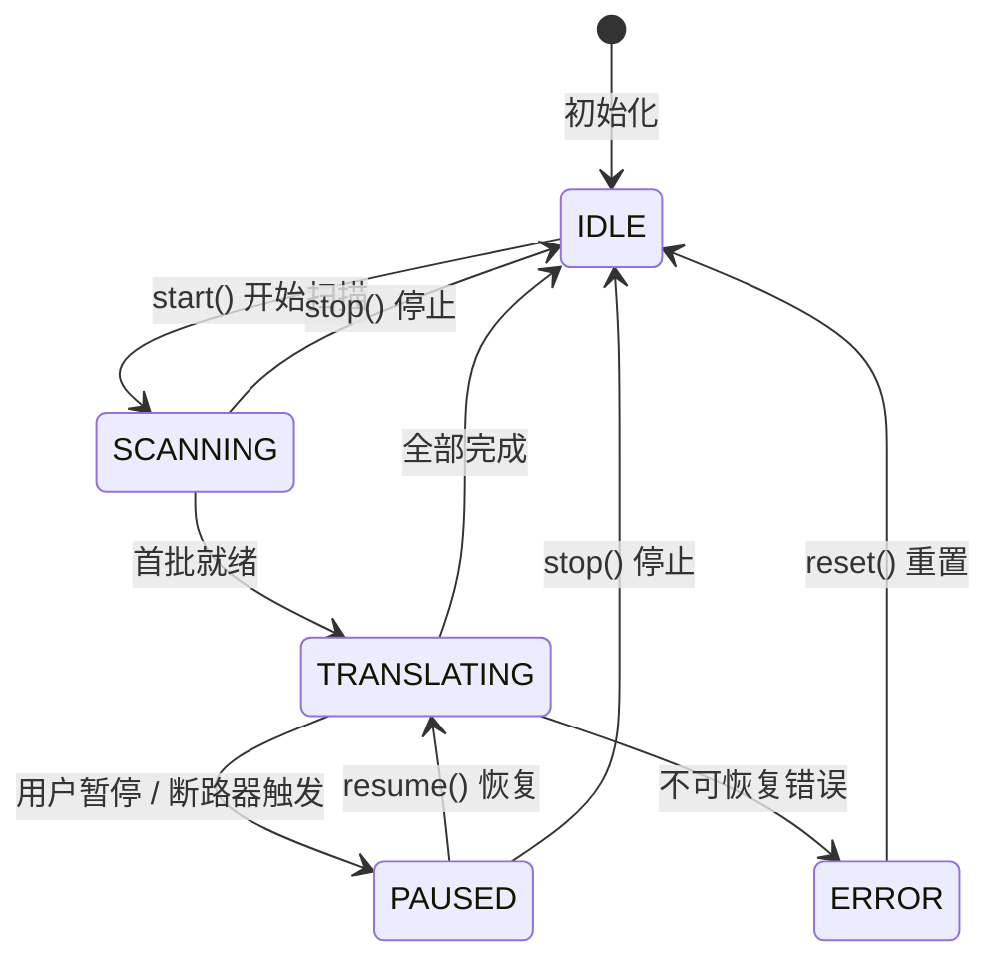
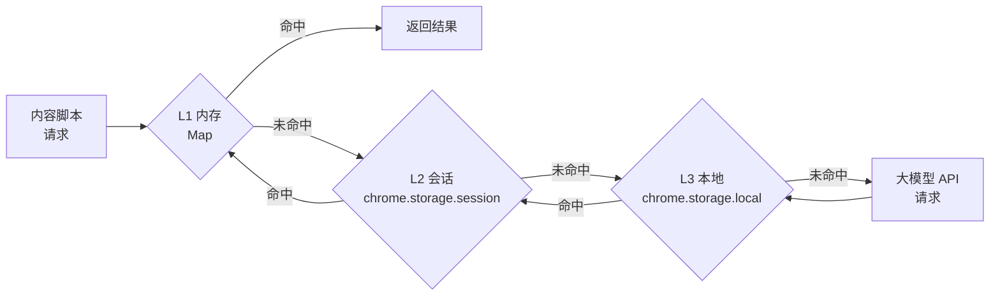
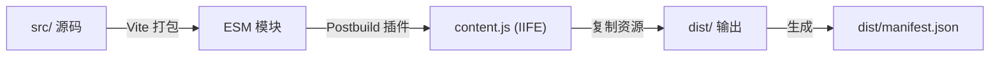
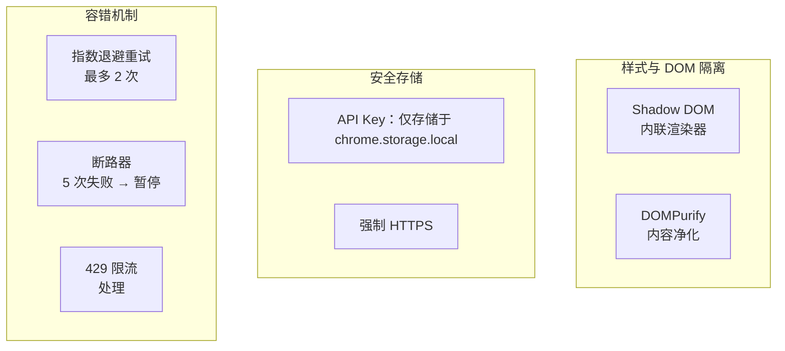

# WebTranslate 系统架构

> 中文版 | [English Version](./architecture-en.md)

## 概览

WebTranslate 是一款基于 Manifest V3 的 Chrome 浏览器扩展，利用大语言模型（LLM）提供网页翻译功能。整体架构遵循典型的浏览器扩展三层模型：**UI 层** → **内容脚本层** → **Service Worker 层**，各层职责清晰，并具备完善的容错机制。

---

## 高层架构图

---

## 组件职责

| 组件 | 层级 | 职责 |
|------|------|------|
| **Popup** | UI | 4 标签设置面板（模型 / 翻译 / 设置 / 统计）。配置校验、连接测试、导入导出。 |
| **侧边栏** | UI | 双语对照翻译列表，支持复制原文/译文、定位到页面段落。 |
| **FAB** | UI | Material 3 悬浮操作按钮，支持拖拽定位、扇形菜单、进度环、随状态变色。 |
| **提取引擎** | 内容脚本 | 多候选内容根节点检测 + 深度 DOM 扫描。提取语义段落，自动排除导航/页脚/代码块。 |
| **批量收集器** | 内容脚本 | 基于 IntersectionObserver 的懒加载收集。防抖批次：最多 8 段、≤800 字符、100ms 防抖。 |
| **状态管理器** | 内容脚本 | 受保护的状态机：`IDLE → SCANNING → TRANSLATING ↔ PAUSED → ERROR`。 |
| **缓存管理器** | 内容脚本 | 三级缓存：L1（内存 Map）→ L2（`chrome.storage.session`）→ L3（`chrome.storage.local`）。LRU 淘汰：每页 500 条、最多 10 页。 |
| **并发控制器** | 内容脚本 | 基于 Promise 的队列，限制并发 API 批次为 3。 |
| **断路器** | 内容脚本 | 连续 5 次失败后触发，切换为 `PAUSED` 状态，防止频繁请求 API。 |
| **内联渲染器** | 内容脚本 | 使用 Shadow DOM 将译文插入原文下方，实现样式隔离，不污染原页面。 |
| **面板渲染器** | 内容脚本 | 通过 Chrome Port API 将翻译结果发送至侧边栏。 |
| **观察管理器** | 内容脚本 | MutationObserver 检测 SPA 动态内容变化，触发重新提取。 |
| **下载触发器** | 内容脚本 | 通过 turndown.js 生成 Markdown，并触发后台 ZIP 打包流程。 |
| **API 代理** | Service Worker | 大模型 API 适配器模式。指数退避重试（2 次，1s→3s）、429 限流处理、AbortController 取消。 |
| **下载管理器** | Service Worker | 抓取页面图片，使用 JSZip 打包，转换为 base64 Data URL 后通过 `chrome.downloads` 触发下载。 |
| **统计追踪器** | Service Worker | 内存级会话统计 + 持久化累计/每日统计。定期刷写到 `chrome.storage.local`。 |
| **配置存储** | Service Worker | `chrome.storage.local` 的简单封装，带内存缓存。 |

---

## 数据流：翻译请求

---

## 状态机

---

## 缓存层级

---

## 构建流程

> 注意：内容脚本使用 IIFE 格式打包（而非 ES 模块），因为 Manifest V3 的内容脚本不支持 `type="module"`。

---

## 安全模型

